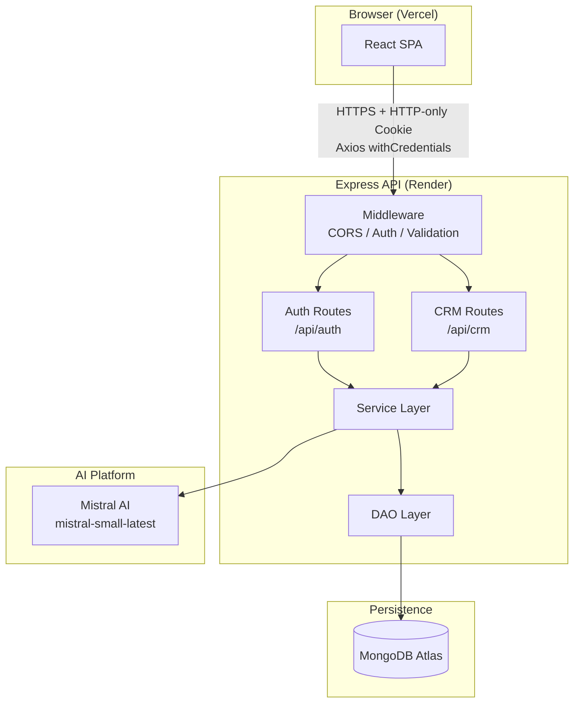
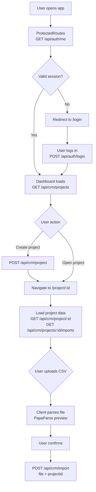
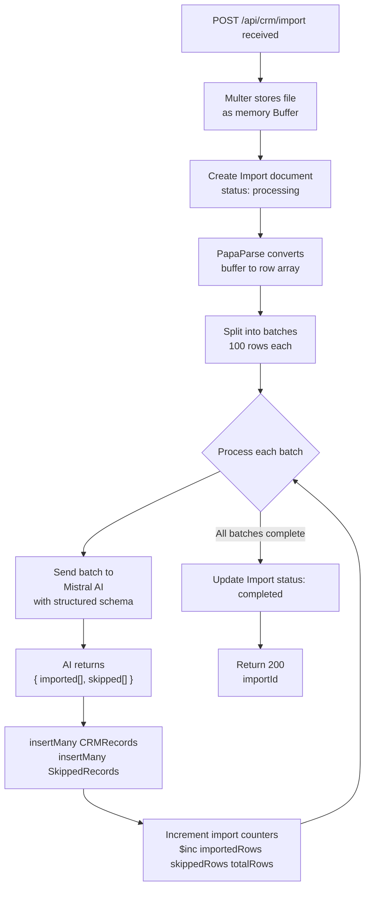
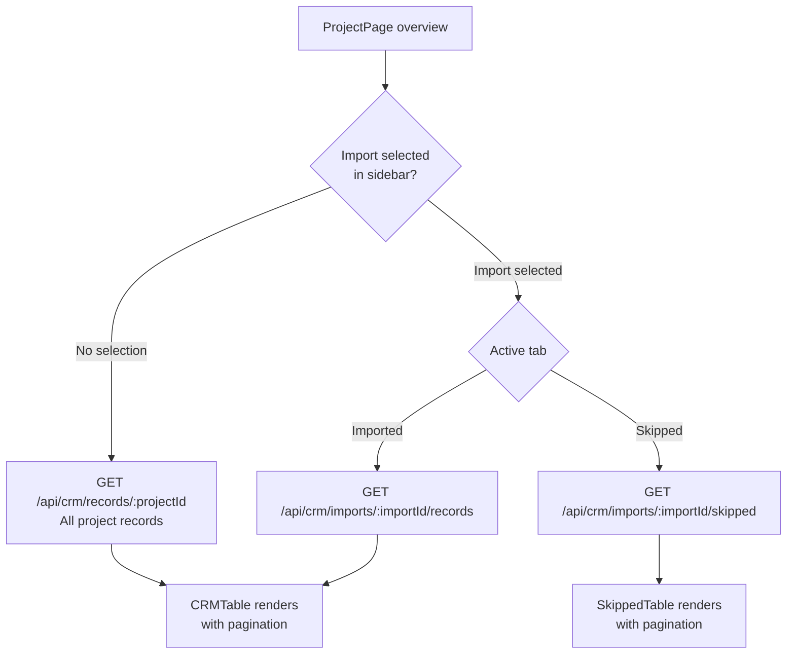
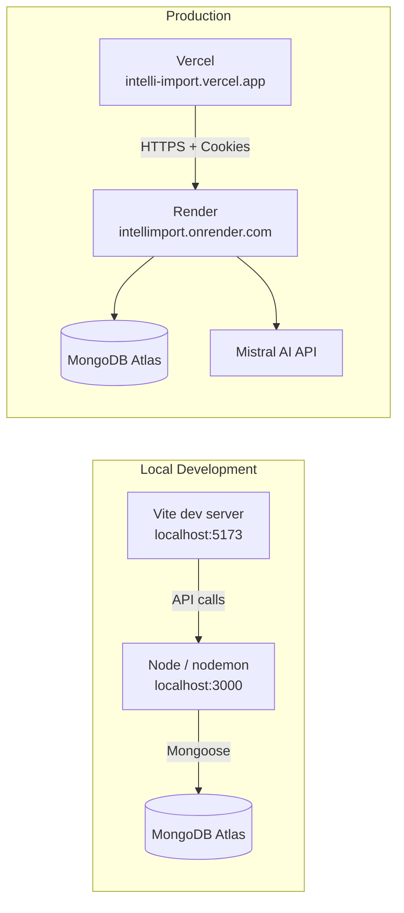

# IntelliImport

IntelliImport is a full-stack AI-powered CRM lead import platform. It allows users to upload raw CSV files containing unstructured lead data and have them automatically normalised, structured, and stored as clean CRM records using a large language model. Records that cannot be reliably mapped are captured separately as skipped entries with an AI-provided reason.

---

## Documentation

This repository contains three README files. Each one focuses on a different level of detail.

| Document | Description |
|---|---|
| [README.md](./README.md) | This file. Project overview, architecture, data flow, and setup. |
| [backend/README.md](./backend/README.md) | Deep-dive into the Express API: layers, models, routes, LLM pipeline, error handling. |
| [frontend/README.md](./frontend/README.md) | Deep-dive into the React SPA: routing, context, state machines, service layer, components. |

---

## Table of Contents

- [Overview](#overview)
- [System Architecture](#system-architecture)
- [Repository Structure](#repository-structure)
- [End-to-End Data Flow](#end-to-end-data-flow)
- [Core Features](#core-features)
- [Technology Stack](#technology-stack)
- [Deployment](#deployment)
- [Getting Started](#getting-started)
- [Environment Variables](#environment-variables)

---

## Overview

The primary problem this application solves is the manual effort required to clean and standardise lead data from disparate CSV sources before it can be used in a CRM system. IntelliImport removes that effort by passing each batch of rows to a Mistral AI model with a structured output schema, which maps arbitrary column names and formats into a consistent CRM record shape.

The application is organised into two separately deployable services:

- **Backend** — A Node.js + Express API deployed on Render
- **Frontend** — A React + Vite SPA deployed on Vercel

---

## System Architecture



---

## Repository Structure

```
IntelliImport/
├── README.md
├── backend/
│   ├── README.md
│   ├── server.js
│   ├── package.json
│   └── src/
│       ├── app.js
│       ├── config/
│       ├── controllers/
│       ├── dao/
│       ├── llm/
│       ├── middleware/
│       ├── models/
│       ├── routes/
│       ├── service/
│       ├── utils/
│       └── validation/
└── frontend/
    ├── README.md
    ├── index.html
    ├── vite.config.js
    ├── vercel.json
    └── src/
        ├── api/
        ├── app/
        ├── features/
        │   ├── auth/
        │   └── crm/
        ├── global/
        └── utils/
```

For full details on each service, see:
- [backend/README.md](./backend/README.md)
- [frontend/README.md](./frontend/README.md)

---

## End-to-End Data Flow

### User Session — From Login to Viewing Records



### CSV Import — Server-Side Processing



### Viewing Results — Record Filtering



---

## Core Features

### Project Management

Users organise their imports into named projects. Each project is isolated per user. Projects can be created, opened, and deleted. Deletion cascades through all associated imports, CRM records, and skipped records in a single coordinated operation.

### AI-Powered CSV Import

Raw CSV files with arbitrary columns are uploaded and processed by the Mistral AI model. The model:

- Maps column values to a fixed CRM record schema
- Enforces a controlled vocabulary for `crm_status` and `data_source`
- Routes multiple emails or phone numbers into `crm_note`
- Skips rows that contain neither an email nor a phone number
- Provides a human-readable reason for each skipped row

AI output is validated against a Zod schema via LangChain's structured output mode before any data reaches the database.

### Import History and Filtering

Each project maintains a full history of every CSV file uploaded. Users can select any import from the sidebar to filter the records table to that specific file, or view the complete project dataset by selecting "All Records".

### Paginated Record Viewing

CRM records and skipped records are paginated server-side. The UI handles imported and skipped pagination independently. Inline data tables display all CRM fields with double-click to expand truncated cells.

### Secure Authentication

Session management uses JWT tokens stored in HTTP-only, SameSite cookies — invisible to JavaScript and inaccessible to XSS attacks. CORS is configured with an explicit origin allowlist and credentials support.

---

## Technology Stack

| Layer | Technology |
|---|---|
| Frontend framework | React 19 |
| Frontend build | Vite 8 |
| Routing | React Router DOM v7 |
| Styling | Tailwind CSS v4 |
| HTTP client | Axios |
| Backend framework | Express 5 |
| Runtime | Node.js (ES Modules) |
| Database | MongoDB with Mongoose |
| AI model | Mistral AI (`mistral-small-latest`) |
| LLM SDK | LangChain (`@langchain/mistralai`, `@langchain/core`) |
| Schema validation | Zod |
| Input validation | express-validator |
| CSV parsing | PapaParse (client and server) |
| Authentication | JWT + bcryptjs |
| File uploads | Multer (in-memory) |
| Frontend hosting | Vercel |
| Backend hosting | Render |
| Database hosting | MongoDB Atlas |

---

## Deployment

### Frontend — Vercel

The frontend deploys as a static SPA. The `vercel.json` rewrite rule redirects all paths to `index.html`, enabling React Router to handle navigation after a hard reload or direct URL access.

Live URL: `https://intelli-import.vercel.app`

### Backend — Render

The backend deploys as a web service. CORS permits cross-origin requests with credentials from the Vercel frontend origin.

Live URL: `https://intelliimport.onrender.com`

### Deployment Overview



---

## Getting Started

### Prerequisites

- Node.js 18 or later
- A MongoDB Atlas cluster (or a local MongoDB instance)
- A Mistral AI API key from [console.mistral.ai](https://console.mistral.ai)

### Running the Backend

```bash
cd backend
npm install
# Create .env with the required variables listed below
npm run dev
# Server starts at http://localhost:3000
```

### Running the Frontend

```bash
cd frontend
npm install
# To point at the local backend, update baseURL in src/api/api.js
# to http://localhost:3000/api
npm run dev
# Vite dev server starts at http://localhost:5173
```

---

## Environment Variables

### Backend (`backend/.env`)

| Variable | Required | Description |
|---|---|---|
| `MONGO_URI` | Yes | Full MongoDB connection string including database name |
| `JWT_SECRET` | Yes | A long random string used to sign JWTs |
| `MISTRAL_API_KEY` | Yes | API key from the Mistral AI platform |
| `NODE_ENV` | No | `development` or `production` (defaults to `development`) |

The application refuses to start if any required variable is missing. There are no frontend environment variables; the API base URL is set directly in `src/api/api.js`.
