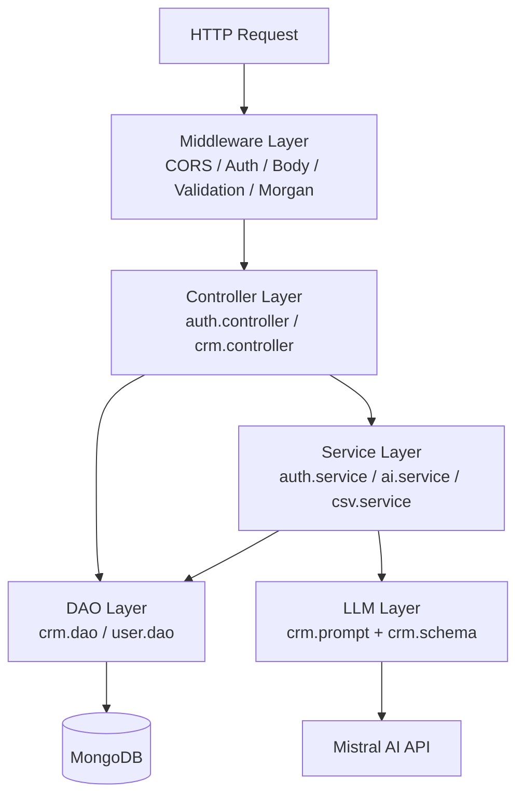
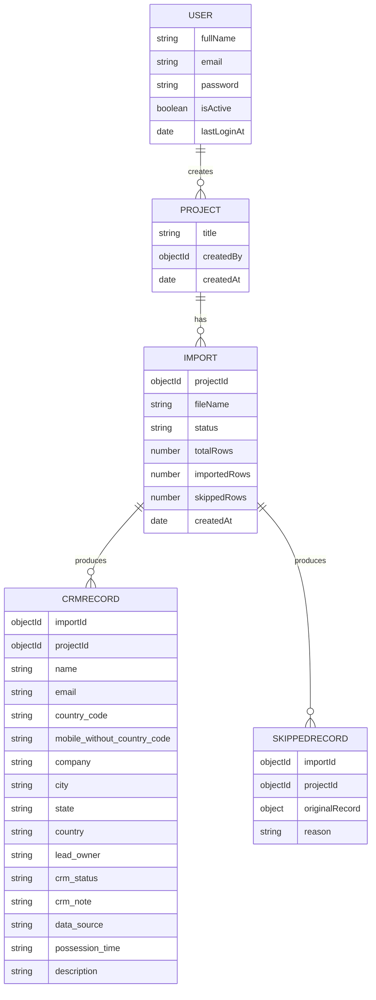
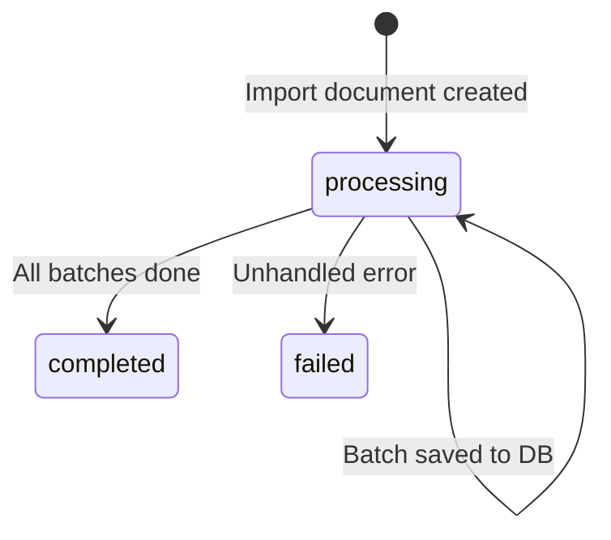
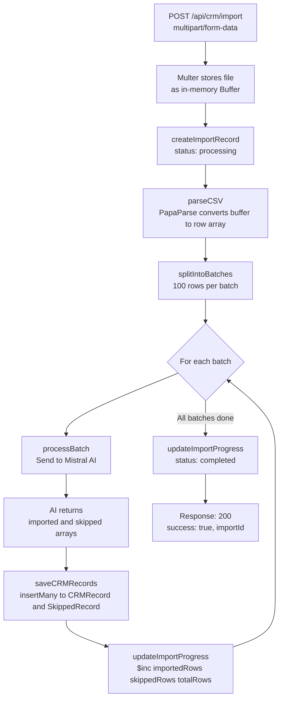
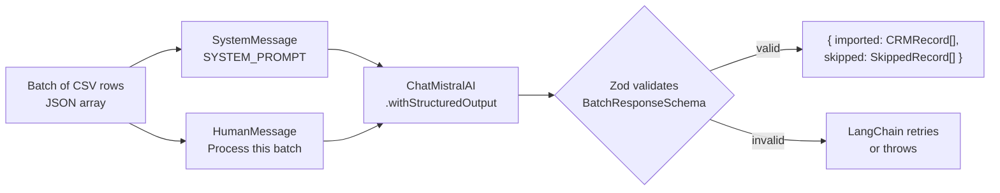
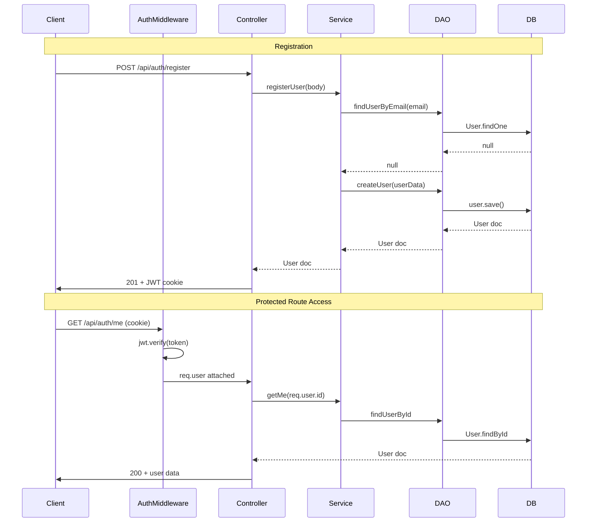
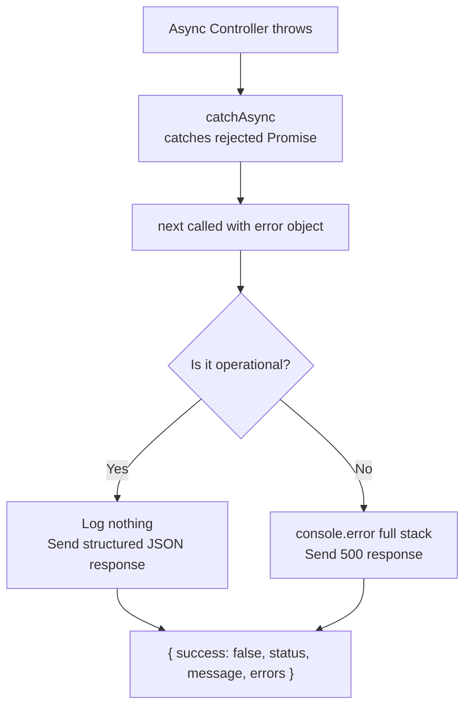
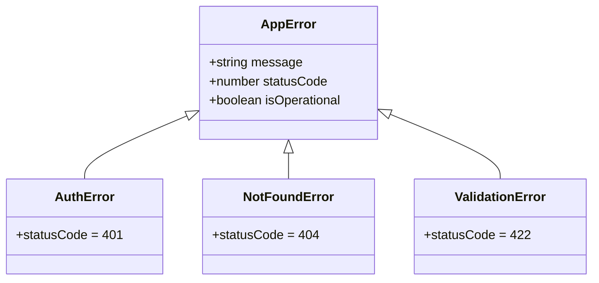
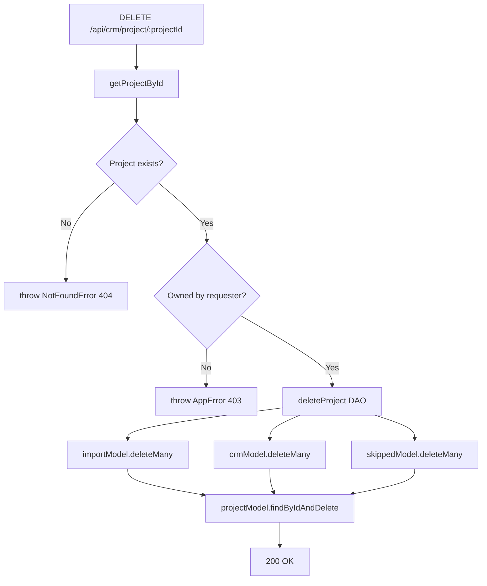

# Backend

This document describes the architecture, request lifecycle, data models, and API surface of the IntelliImport backend service.

---

## Technology Stack

| Concern | Choice |
|---|---|
| Runtime | Node.js (ES Modules) |
| Framework | Express 5 |
| Database | MongoDB via Mongoose |
| Authentication | JSON Web Tokens stored in HTTP-only cookies |
| AI / LLM | Mistral AI via LangChain (`mistral-small-latest`) |
| CSV Parsing | PapaParse |
| Input Validation | express-validator + Zod (for structured LLM output) |
| Password Hashing | bcryptjs |
| File Uploads | Multer (in-memory storage) |
| Logging | Morgan |

---

## Project Structure

```
backend/
├── server.js                   # Entry point: starts HTTP server and connects to DB
└── src/
    ├── app.js                  # Express application: middleware and route registration
    ├── config/
    │   ├── config.js           # Reads and validates environment variables
    │   ├── db.js               # Mongoose connection
    │   └── multer.js           # Multer configuration (in-memory buffer)
    ├── controllers/
    │   ├── auth.controller.js  # Handles register, login, logout, getMe
    │   └── crm.controller.js   # Handles project CRUD and CSV import pipeline
    ├── dao/
    │   ├── crm.dao.js          # All database operations for CRM domain
    │   └── user.dao.js         # User lookup and creation
    ├── llm/
    │   ├── prompts/
    │   │   └── crm.prompt.js   # System prompt sent to the LLM
    │   └── schema/
    │       └── crm.schema.js   # Zod schema for structured LLM output
    ├── middleware/
    │   ├── auth.middleware.js  # JWT verification from cookies
    │   ├── error.middleware.js # Centralised error handler
    │   └── validate.middleware.js
    ├── models/
    │   ├── user.model.js
    │   ├── project.model.js
    │   ├── import.model.js
    │   ├── crm.model.js
    │   └── skipped.model.js
    ├── routes/
    │   ├── auth.routes.js      # /api/auth/* routes
    │   └── crm.route.js        # /api/crm/* routes
    ├── service/
    │   ├── auth.service.js     # Business logic for authentication
    │   ├── ai.service.js       # Calls the Mistral LLM with structured output
    │   └── csv.service.js      # CSV parsing and batch splitting
    ├── utils/
    │   ├── catchAsync.js
    │   ├── setToken.js
    │   └── errors/
    │       ├── AppError.js
    │       ├── AuthError.js
    │       ├── NotFoundError.js
    │       └── ValidationError.js
    └── validation/
        ├── auth.validation.js
        └── crm.validation.js
```

---

## Architecture and Layering

The backend follows a strict, unidirectional layered architecture. Each layer has a single responsibility and only communicates with the layer directly below it.



---

## Data Models

### Relationship Overview



### User

| Field | Type | Notes |
|---|---|---|
| `fullName` | String | max 120 characters |
| `email` | String | unique, lowercase |
| `password` | String | bcrypt-hashed, never returned by default |
| `isActive` | Boolean | default `true` |
| `lastLoginAt` | Date | optional |

The `pre("save")` hook hashes the password automatically. The `comparePassword` method provides safe comparison using bcrypt.

### Import — Status Lifecycle



### CRMRecord — `crm_status` Enum

| Value | Meaning |
|---|---|
| `GOOD_LEAD_FOLLOW_UP` | Qualified lead requiring follow-up |
| `DID_NOT_CONNECT` | Contact attempt made, no response |
| `BAD_LEAD` | Lead disqualified |
| `SALE_DONE` | Conversion completed |

---

## CSV Import Pipeline

This is the core workflow of the application. When a user uploads a CSV file, the following sequence executes synchronously within a single HTTP request.



---

## LLM Integration

The AI layer uses LangChain with the `ChatMistralAI` adapter.

- **Model**: `mistral-small-latest`
- **Temperature**: `0` (deterministic output)
- **Output mode**: Structured output enforced via a Zod schema



The system prompt instructs the model to skip rows with no email and no phone, enforce a controlled vocabulary for status and data source values, and return only structured JSON.

---

## Authentication Flow



---

## API Reference

### Authentication Routes — `/api/auth`

| Method | Path | Access | Description |
|---|---|---|---|
| `POST` | `/register` | Public | Register a new user. Body: `fullName`, `email`, `password`. |
| `POST` | `/login` | Public | Login and receive a JWT cookie. Body: `email`, `password`. |
| `POST` | `/logout` | Private | Clears the JWT cookie. |
| `GET` | `/me` | Private | Returns the authenticated user profile. |

### CRM Routes — `/api/crm`

| Method | Path | Access | Description |
|---|---|---|---|
| `GET` | `/projects` | Private | List all projects for the authenticated user. |
| `POST` | `/project` | Private | Create a new project. Body: `{ name }`. |
| `GET` | `/project/:projectId` | Private | Get a specific project. |
| `DELETE` | `/project/:projectId` | Private | Delete project and all its associated data. |
| `GET` | `/projects/:projectId/imports` | Private | List imports for a project. Supports `?page` and `?limit`. |
| `POST` | `/import` | Private | Upload and process a CSV file. Multipart: `file` + `projectId`. |
| `GET` | `/imports/:importId` | Private | Get a single import record. |
| `GET` | `/imports/:importId/records` | Private | Get paginated CRM records for an import. |
| `GET` | `/imports/:importId/skipped` | Private | Get paginated skipped records for an import. |
| `GET` | `/imports/:importId/stats` | Private | Get import statistics. |
| `GET` | `/records/:projectId` | Private | Get all CRM records across a project (paginated). |

### Health Check

| Method | Path | Description |
|---|---|---|
| `GET` | `/health` | Returns service status and timestamp. |

---

## Error Handling

All errors flow through the centralised `error.middleware.js`.



### Custom Error Hierarchy



---

## Cascading Deletion

Deleting a project triggers coordinated cleanup across all collections.



---

## Environment Variables

The `config.js` module throws immediately on startup if any required variable is absent.

| Variable | Required | Description |
|---|---|---|
| `MONGO_URI` | Yes | MongoDB connection string |
| `JWT_SECRET` | Yes | Secret used to sign and verify JWTs |
| `MISTRAL_API_KEY` | Yes | API key for the Mistral AI platform |
| `NODE_ENV` | No | `development` or `production` (default: `development`) |

---

## Local Development

```bash
cd backend
npm install
# Create a .env file with the variables listed above
npm run dev   # starts with nodemon on port 3000
```

CORS is configured to allow requests from `http://localhost:5173` (Vite dev server) and the production Vercel domain.
