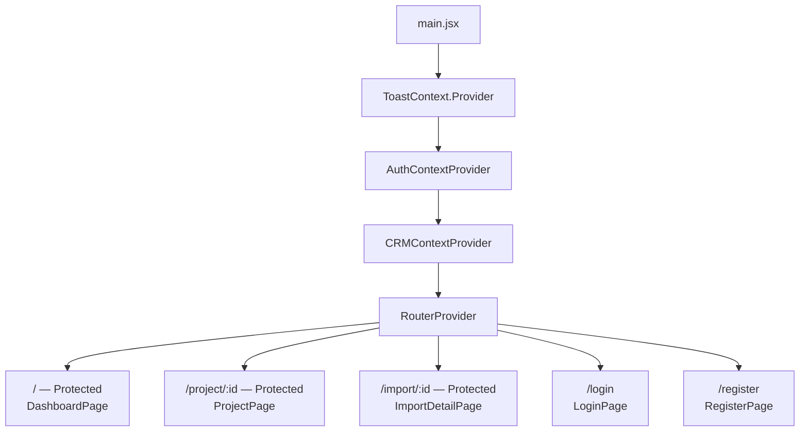
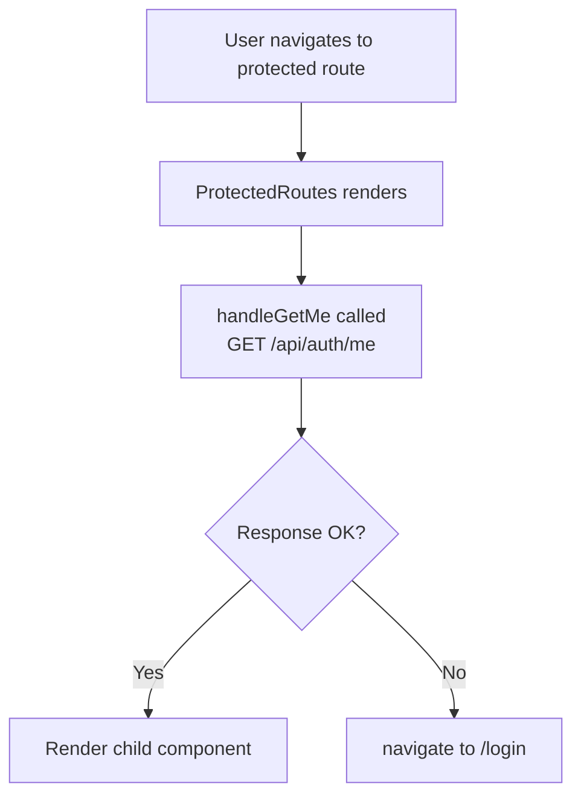
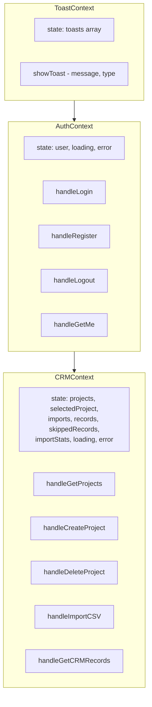
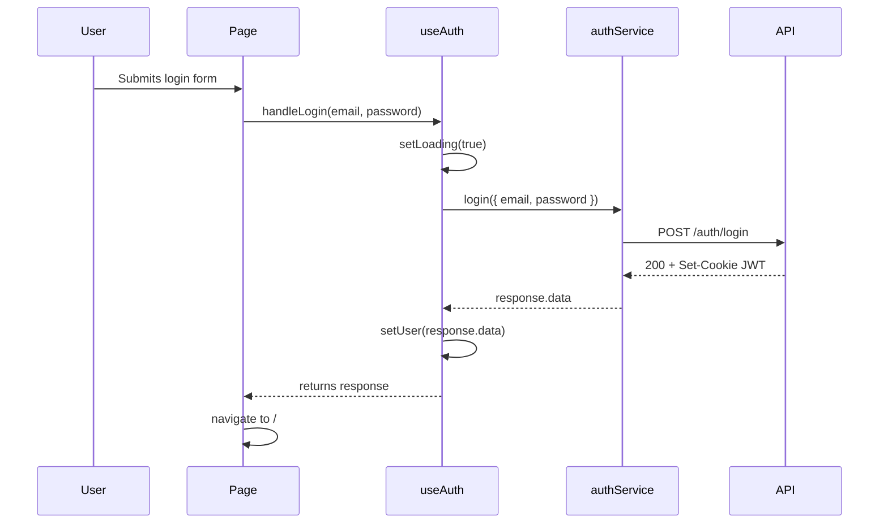
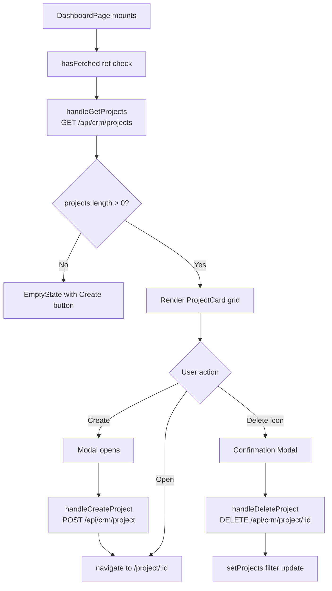
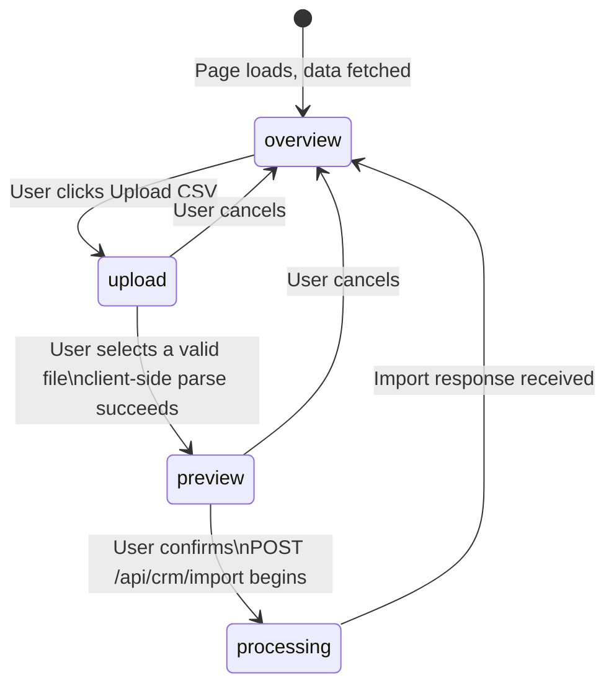
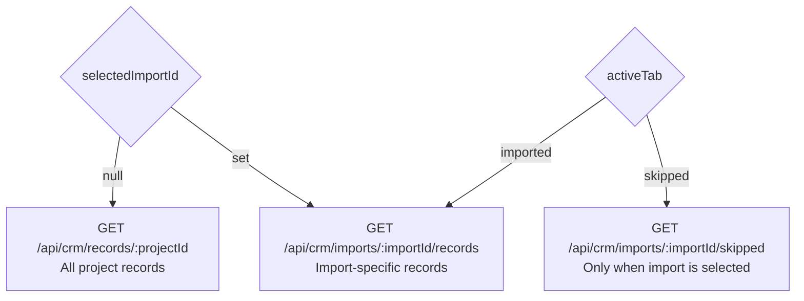
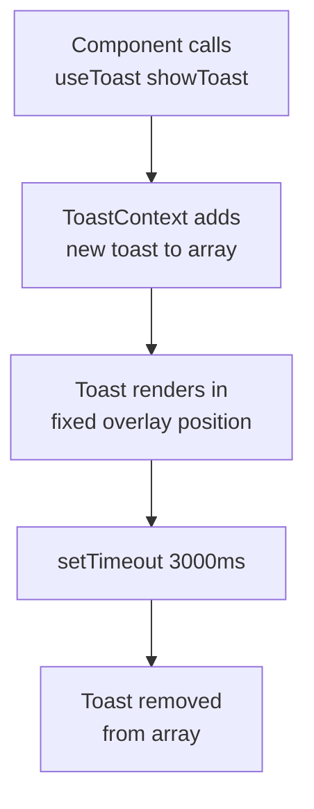
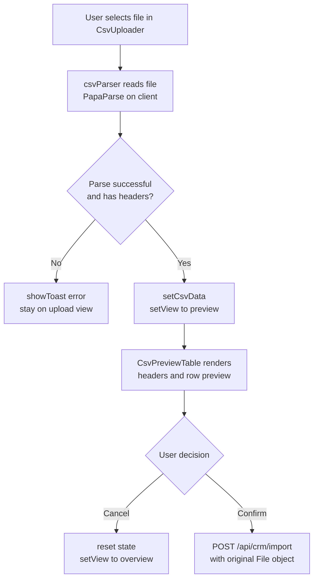

# Frontend

This document describes the architecture, component hierarchy, state management patterns, routing, and service layer of the IntelliImport frontend application.

---

## Technology Stack

| Concern | Choice |
|---|---|
| Framework | React 19 |
| Build Tool | Vite 8 |
| Routing | React Router DOM v7 |
| HTTP Client | Axios |
| Styling | Tailwind CSS v4 |
| CSV Parsing (client-side) | PapaParse |
| Deployment | Vercel |

---

## Project Structure

```
frontend/
├── index.html
├── vite.config.js
├── vercel.json                         # SPA rewrite rule for client-side routing
└── src/
    ├── main.jsx                        # Application bootstrap, provider tree
    ├── api/
    │   └── api.js                      # Axios instance with base URL and credentials
    ├── app/
    │   ├── App.jsx                     # Wraps the router provider
    │   ├── App.routes.jsx              # Route definitions with protected wrappers
    │   └── index.css                   # Global base styles
    ├── assets/                         # Static assets
    ├── features/
    │   ├── auth/
    │   │   ├── auth.context.jsx
    │   │   ├── Auth.context.provider.jsx
    │   │   ├── components/
    │   │   │   ├── AuthInput.jsx
    │   │   │   └── AuthButton.jsx
    │   │   ├── hooks/
    │   │   │   └── useAuth.jsx
    │   │   ├── pages/
    │   │   │   ├── LoginPage.jsx
    │   │   │   └── RegisterPage.jsx
    │   │   └── service/
    │   │       └── auth.service.js
    │   └── crm/
    │       ├── crm.context.jsx
    │       ├── CRM.context.provider.jsx
    │       ├── components/
    │       │   ├── CsvUploader.jsx
    │       │   └── CsvPreviewTable.jsx
    │       ├── hooks/
    │       │   └── useCRM.jsx
    │       ├── pages/
    │       │   ├── DashboardPage.jsx
    │       │   ├── ProjectPage.jsx
    │       │   └── ImportDetailPage.jsx
    │       └── service/
    │           └── crm.service.js
    ├── global/
    │   ├── components/
    │   │   ├── AppLayout.jsx
    │   │   ├── Buttons.jsx
    │   │   ├── EmptyState.jsx
    │   │   ├── Modal.jsx
    │   │   ├── Navbar.jsx
    │   │   └── StatusBadge.jsx
    │   ├── context/
    │   │   └── ToastContext.jsx
    │   └── hooks/
    │       └── useToast.jsx
    └── utils/
        ├── ProtectedRoutes.jsx
        └── csvParser.js
```

---

## Application Architecture

The application uses a feature-based folder structure. Each feature owns its context, hooks, pages, components, and service layer. Shared infrastructure lives in `global/`.



---

## Routing

Routes are defined in `App.routes.jsx` using `createBrowserRouter`.

| Path | Component | Protected |
|---|---|---|
| `/login` | `LoginPage` | No |
| `/register` | `RegisterPage` | No |
| `/` | `DashboardPage` | Yes |
| `/project/:projectId` | `ProjectPage` | Yes |
| `/import/:importId` | `ImportDetailPage` | Yes |

### Protected Route Guard



The `vercel.json` catch-all rewrite ensures hard refreshes or direct URL access always serve `index.html`, allowing React Router to take over on the client.

---

## Context and State Management

### Provider Stack



### CRM Loading State Design

The `loading` object in CRMContext uses named boolean flags instead of a single boolean. This allows different sections of the UI to show independent loading states without blocking each other.

```javascript
loading: {
  projects: false,
  createProject: false,
  deleteProject: false,
  projectDetails: false,
  imports: false,
  importCSV: false,
  importDetails: false,
  records: false,
  skippedRecords: false,
  stats: false,
}
```

---

## Feature: Authentication

### Login and Registration Flow



The same pattern applies to `handleRegister` and `handleLogout`. On logout, the server clears the HTTP-only cookie and the client sets `user` to `null`.

---

## Feature: CRM

### Dashboard Page Flow



### Project Page State Machine

The `ProjectPage` component manages a `view` state that controls which panel is rendered. This acts as a client-side state machine.



### Import Sidebar and Record Filtering

The sidebar lists every CSV file previously uploaded to the project. The selected import drives which API call populates the records table on the right.



Pagination is handled locally via `recordsPage` and `skippedPage` state. The component detects whether more pages exist by checking if the returned array length equals the configured page limit.

---

## Service Layer

The service layer contains functions that make direct Axios calls. Error handling is done exclusively by the hook layer that wraps each call.

### Auth Service

| Function | Method | Endpoint |
|---|---|---|
| `login(payload)` | POST | `/auth/login` |
| `register(payload)` | POST | `/auth/register` |
| `logout()` | POST | `/auth/logout` |
| `getMe()` | GET | `/auth/me` |

### CRM Service

| Function | Method | Endpoint |
|---|---|---|
| `getProjects()` | GET | `/crm/projects` |
| `createProject(payload)` | POST | `/crm/project` |
| `getProject(projectId)` | GET | `/crm/project/:projectId` |
| `deleteProject(projectId)` | DELETE | `/crm/project/:projectId` |
| `getImportsByProject(projectId, params)` | GET | `/crm/projects/:projectId/imports` |
| `importCSV({ file, projectId })` | POST | `/crm/import` (multipart) |
| `getImport(importId)` | GET | `/crm/imports/:importId` |
| `getCRMRecordsByImport(importId, params)` | GET | `/crm/imports/:importId/records` |
| `getSkippedRecords(importId, params)` | GET | `/crm/imports/:importId/skipped` |
| `getImportStats(importId)` | GET | `/crm/imports/:importId/stats` |
| `getCRMRecords(projectId, params)` | GET | `/crm/records/:projectId` |

All paginated endpoints apply `page` and `limit` query parameters via the `withPaginationDefaults` helper.

---

## HTTP Client Configuration

The Axios instance in `api/api.js` is configured with:

- **Base URL**: `https://intelliimport.onrender.com/api`
- **withCredentials**: `true` — required so the browser sends and receives the HTTP-only JWT cookie across origins

---

## Global Components

| Component | Description |
|---|---|
| `AppLayout` | Wraps all authenticated pages. Renders `Navbar` and a content area. |
| `Navbar` | Top bar with the application name and a logout button. |
| `Modal` | Portal-based overlay. Accepts `isOpen`, `onClose`, `title`, and a `footer` slot. |
| `Btn` | Primary action button. The `loading` prop replaces content with a spinner. |
| `GhostBtn` | Secondary/outlined button variant. |
| `StatusBadge` | Coloured pill for import statuses: `processing`, `completed`, `failed`. |
| `EmptyState` | Placeholder with optional icon, title, subtitle, and action slot. |

---

## Toast Notification System



---

## Client-Side CSV Preview

Before submitting to the server, the client parses the file using PapaParse to extract headers and a row preview. This populates the `CsvPreviewTable` component for user review. No data reaches the backend until the user explicitly clicks "Confirm & Import".



---

## Local Development

```bash
cd frontend
npm install
npm run dev   # Vite dev server starts at http://localhost:5173
```

To point at a local backend instead of the production Render service, change the `baseURL` in `src/api/api.js` to `http://localhost:3000/api`.
